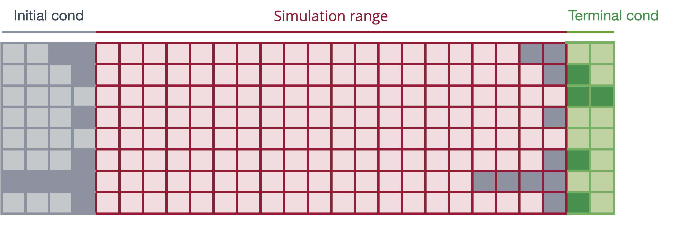
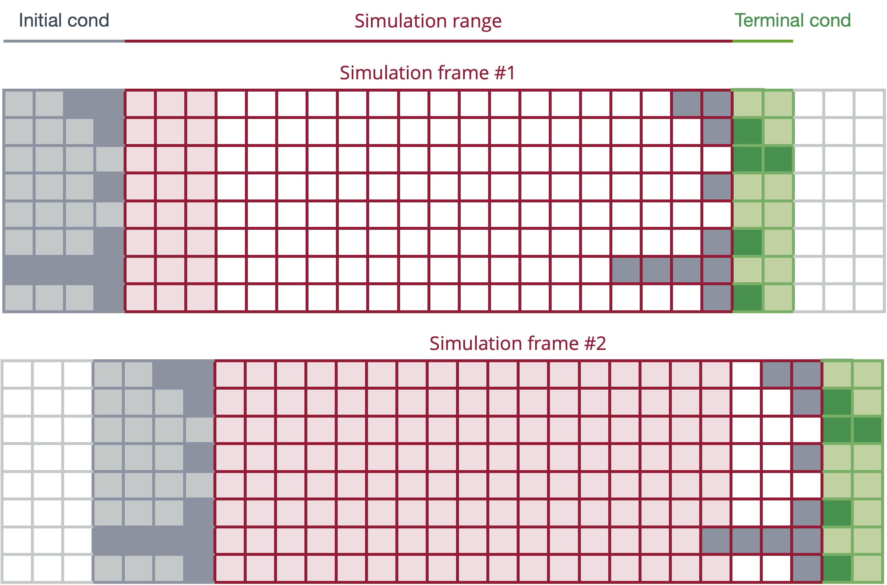

# Stacked time solution method with first-order terminal condition


![[title-page.md]]


---

## Overview

* Stacked time system

* Simulation procedure and terminal condition

* Changes in information sets


---

## Model equations

System of $n$ dynamic conditional-expectations equations

$$
\begin{gathered}
\mathrm E_t \bigl[\ f_1\left(x_{t-k}, \dots, x_{t+m} \right) \ \bigr] = 0 \\[5pt]
\mathrm E_t \bigl[\ f_2\left(x_{t-k}, \dots, x_{t+m} \right) \ \bigr] = 0 \\[5pt]
\vdots \\[5pt]
\mathrm E_t \bigl[\ f_n\left(x_{t-k}, \dots, x_{t+m} \right) \ \bigr] = 0
\end{gathered}
\notag
$$

where

* $n$ is the number of model equations

* $x_t$ is an $n \times 1$ vector model variables

* $\mathrm E_t\!\left[\cdot\right]$ is a conditional expectations operator

* $k$ is the maximum lag

* $m$ is the maximum lead


---

## Stacked time setup

* Simulation range $t=1, \dots, T$

* Drop the expectations operator

* Stack the $n$ equations for the $T$ simulation periods 

* Create a large static system of $T\times n$ equations in $T\times n$ unknowns 

* Known initial conditions $x_{1-k}, \dots, x_{0}$

* Unknown terminal conditions $x_{T+1}, \dots, x_{T+m}$


---

## Stacked time system of equations and unknowns

* A total of $n \cdot T$ equations

* A total of $n \cdot T$ unknows, $x_t,\ t = 1, \dots, T$

<br/>

$$
\begin{gathered}
f_1\left(x_{1-k}, \dots, x_{1+m} \right) = 0 \\[5pt]
f_2\left(x_{1-k}, \dots, x_{1+m} \right) = 0 \\[5pt]
\vdots \\[5pt]
f_n\left(x_{1-k}, \dots, x_{1+m} \right) = 0 \\[5pt]
\vdots \\[5pt]
\vdots \\[5pt]
f_1\left(x_{T-k}, \dots, x_{T+m} \right) = 0 \\[5pt]
f_2\left(x_{T-k}, \dots, x_{T+m} \right) = 0 \\[5pt]
\vdots \\[5pt]
f_n\left(x_{T-k}, \dots, x_{T+m} \right) = 0
\end{gathered}
\notag
$$

---

## Simulation setup

Initialize

* Create an $n\times (T+k+m)$ matrix

* Fill in initial condition in columns $1, \dots, k$

In each iteration

* Fill in the simulation range columns

* Taking the last simulation range columns as initial condition, use the
  first order simulator to fill in terminal codnition 
  
* Evaluate the LHS–RHS discrepancy for all $n\times T$ equations and send
  this information to the solver


---

## Visualization of the simulation setup




---


## Terminal condition derived from first-order solution

First-order solution of the model (model-consistent expectations of endogenous variables integrated away)

$$
x_t \approx T \ x_{t-1} + K + R_0 \ \varepsilon_t 
+ \cdots + R_h \ \mathrm E_t \! \left[ \varepsilon_{t+h} \right]
\notag
$$


Create a stacked system to calculate the terminal condition points needed
$$
\begin{bmatrix}
x_{T+1} \\[5pt]
\vdots \\[5pt]
x_{T+m}
\end{bmatrix} =
T^\mathrm{term}
\begin{bmatrix}
x_{T+1-k} \\[5pt]
\vdots \\[5pt]
x_{T}
\end{bmatrix}
+ K^\mathrm{term}
\notag
$$


---

## Changes in information sets within a simulation

* By design, a stacked time simulation is consistent with an assumption of
  all future events (shocks, swaps) are anticipated

* To simulate a sequence of unanticipated events, the simulation needs to
  be broken down into a sequence of sub-simulations (simulation frames)


---

## Breakdown of simulation into frames




---

## Implemenation in IrisT

Syntax of the `simulate` function for the stacked time method

```
[outputDb, info, frameDb] = simulate( ...
    model, inputDb, range ...
    , method="stacked" ...
);
```

Output structure `info`

Auxiliary output databank with simulation frames `frameDb`

Options to control the setup of the stacked time method

`startIter=`

* `"firstOrder"` (default)
* `"data"`

`terminal=`

* `"firstOrder"` (default)
* `"data"`

